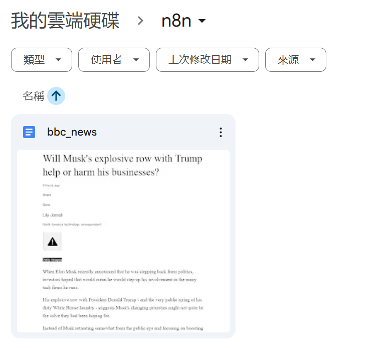
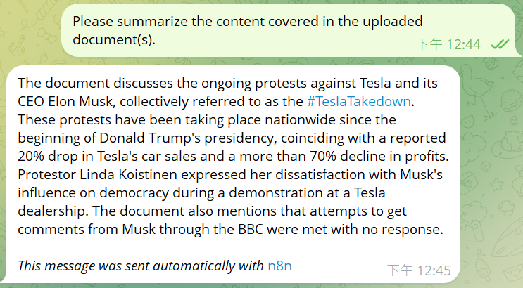
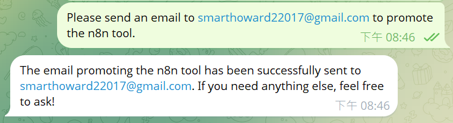
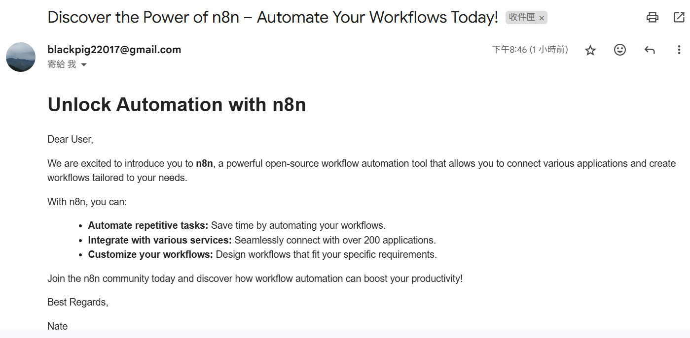

## n8n AI Automation Project

This n8n project demonstrates two intelligent automation workflows powered by OpenAI, Gmail API, and Google Drive integration.

---

### 🛠️ Tool 1: **RAG Company AI**

A document-aware AI assistant for internal corporate Q&A.

#### Workflow Overview:

Phase I
1. A file is added or updated in Google Drive
2. The document is downloaded → split into chunks → embedded using OpenAI
3. Embeddings are stored in Pinecone Vector Store

Phase II
1. Telegram receives a user question
2. The question is embedded and sent to Pinecone for semantic search
3. Relevant chunks are retrieved → passed to OpenAI → response is generated

#### 🧠 Example:

1. A user uploads a document to Google Drive.  
2. The Company AI ingests and stores the knowledge.  
3. Later, another user asks a question and receives an instant, AI-generated answer.

**Results:**

  

---

### 🛠️ Tool 2: **AutoEmail Agent**

An intelligent text-to-email assistant powered by OpenAI.

#### 🔄 Workflow Overview:

1. **Text input via Telegram**
2. `Set Text` passes the input to `Email Agent`
3. The `Email Agent` sends structured content (recipient / subject / body) to OpenAI Chat
4. OpenAI generates a professional email 
5. Sent via Gmail API

#### 📩 Example:

> The user wants to send an email to **smarthoward22017@gmail.com** to promote the n8n tool.

**Results:**

  

---

### 🔗 Technologies Used

* **n8n** for visual workflow orchestration  
* **OpenAI** for natural language processing and response generation  
* **Gmail API** for automated email actions  
* **Google Drive + Pinecone** for RAG (Retrieval-Augmented Generation) over company documents
